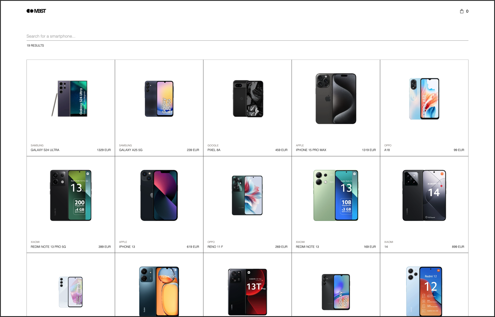
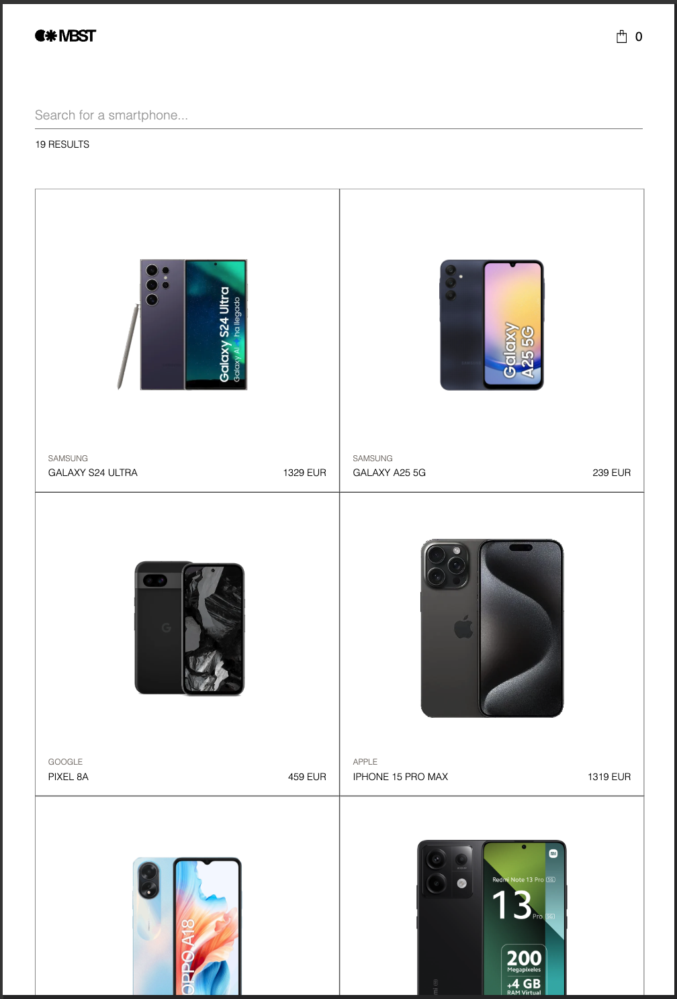
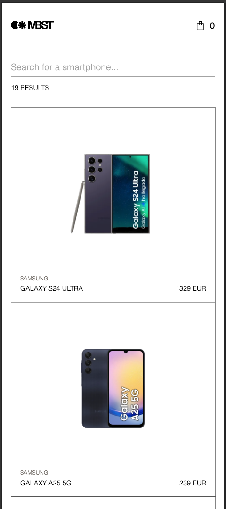
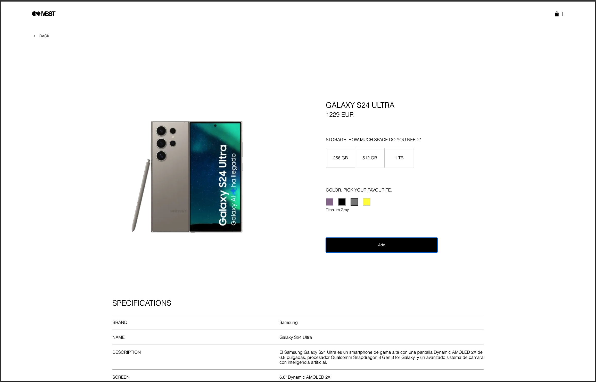
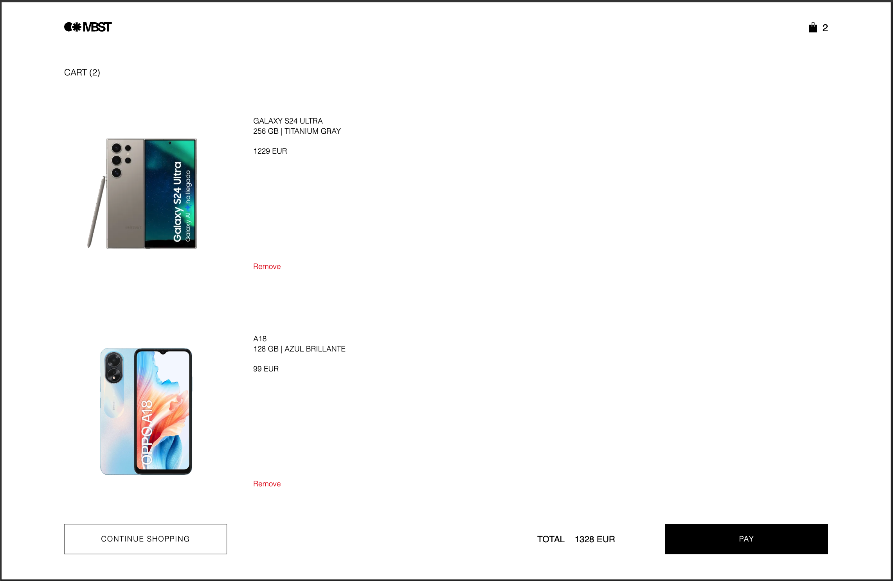
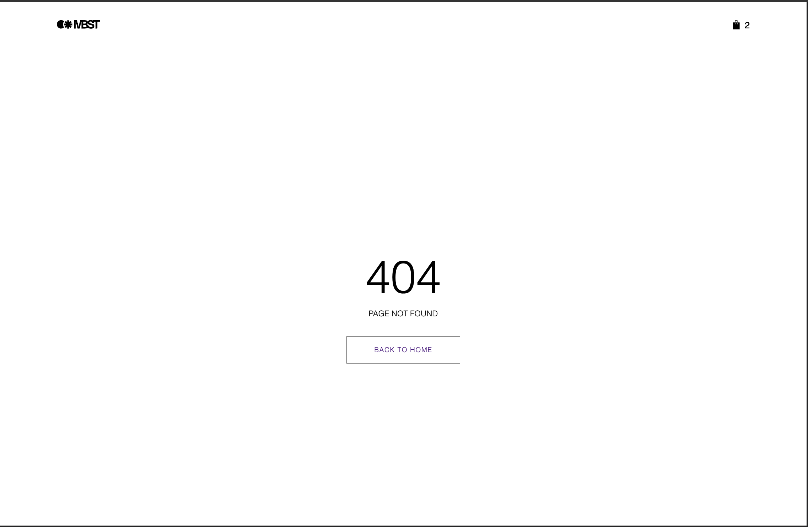

# Mobile phone catalog

A web application for browsing, searching and managing a mobile phone catalog, built as part of a technical challenge.

## Live Demo

[Live demo](https://clopezca.github.io/zara-challenge/)

## Screenshots

### Product List

<p>
  
  
  
</p>

### Product Detail



### Cart



### 404



## Tech stack

- **React 19** with TypeScript
- **Vite** — dev and production build tool with manual chunk splitting for optimal caching
- **React Router v7** — client-side routing with lazy loading
- **SASS** — styling with CSS custom properties for consistent theming
- **Vitest + React Testing Library** — unit and component testing
- **ESLint + Prettier** — linting and formatting

## Getting Started

### Prerequisites

- Node.js >= 18
- npm >= 9

### Installation

```bash
git clone
cd zara-challenge
npm install
```

### Environment variables

Create a `.env.local` file in the root of the project:

```
VITE_API_URL=your_api_url
VITE_API_KEY=your_api_key
```

### Development mode

```bash
npm run dev
```

### Production mode

```bash
npm run build
npm run preview
```

### Run tests

```bash
npm run test
npm run test:coverage
```

### Lint and format

```bash
npm run lint
npm run format
```

## Architecture

The project follows a feature-based architecture with a clear separation of concerns:

```
src/
├── assets/ # SVG icons
├── components/ # Shared UI components (Navbar, BackButton, LoadingBar, etc.)
├── context/ # React Context API
│ ├── cart/ # Cart state with localStorage persistence
│ └── loading/ # Global loading state
├── features/
│ ├── cart/
│ │ └── components/ # Cart-specific components
│ └──products/
│   ├── components/ # Product-specific components
│   └── hooks/ # useProducts, useProductDetail
├── hooks/ # Shared hooks (useDebounce)
├── mocks/ # MSW handlers and server setup for testing
├── pages/ # Page components (ProductListPage, ProductDetailPage, CartPage, NotFoundPage)
├── services/ # API client and product services
├── styles/ # Global styles and SASS variables
├── types/ # TypeScript interfaces
└── utils/ # Utility functions
```

### State Management

- **Server state** — managed with custom hooks (`useProducts`, `useProductDetail`) using `fetch` with `AbortController` for race condition handling
- **Global UI state** — `LoadingContext` for the loading bar animation
- **Cart state** — `CartContext` with `localStorage` persistence
- **Local state** — `useState` for component-level interactions (color/storage selection)

### Routing

Client-side routing with React Router v7. All pages are lazy-loaded with `React.lazy` and `Suspense` for better initial load performance.

### Custom Hooks

- **`useProducts`** — fetches the product list with search support, debouncing and AbortController for cancelling in-flight requests
- **`useProductDetail`** — fetches a single product by id with the same cancellation pattern
- **`useDebounce`** — generic debounce hook used to delay search API calls until the user stops typing (300ms)
- **`useCart`** — consumes `CartContext` and exposes cart state and actions (addItem, removeItem, total, totalCount)
- **`useLoading`** — consumes `LoadingContext` and exposes the global loading state used by the loading bar

### Tech Decisions

**Vitest over Jest** — Vitest is natively integrated with Vite, sharing the same config and transform pipeline. This means faster test runs, no extra Babel config and native TypeScript support out of the box.

**SASS + CSS Custom Properties** — SASS handles reusable mixins and nesting while CSS custom properties provide runtime theming and consistent design tokens across the app.

**Context API over Redux** — the app state is simple enough that Context API is sufficient. Two contexts handle global state: `LoadingContext` for the loading bar and `CartContext` for the cart. Adding Redux would be over-engineering for this scope.

**Vite Manual Chunk Splitting** — React, React DOM and React Router are split into separate chunks. This way, when the app code changes, users only re-download the app chunk — not the unchanged vendor dependencies.

## Testing

The project has two levels of tests:

- **Unit and component tests** — hooks, contexts, services, utilities and individual components tested in isolation with mocked dependencies
- **Integration tests with MSW** — complete user flows tested using Mock Service Worker to intercept HTTP requests, allowing the full stack to run without external dependencies

**110 tests** across all levels with **97% statement coverage**.

Run `npm run test:coverage` to see the full coverage report.

## Accessibility & Performance

Audited with Lighthouse and WAVE after implementation:

- **Lighthouse Accessibility: 100/100**
- **Lighthouse Performance: ~83/100** (dev mode — production build will score higher due to minification)
- **WAVE Score: 9.8/10**

Accessibility improvements include ARIA roles, labels, live regions for dynamic content, semantic HTML and keyboard navigation support.

Performance optimizations include `preconnect` hints, `fetchPriority="high"` on LCP images, explicit image dimensions to reduce CLS and manual chunk splitting.

## Features implemented

- Product list with responsive grid (mobile, tablet, desktop)
- Real-time search by name or brand (min. 3 characters, debounced 300ms)
- Results counter
- Global loading bar animation while fetching data
- Error state when API fails
- Fade-in animation on product grid and page load
- Product detail with dynamic image, storage and color selectors
- Price updates based on selected storage
- Add to cart button — active only when color and storage are selected
- Specifications table
- Similar products with horizontal scroll and custom scroll indicator
- Back button navigation
- Sticky navbar and search input
- Cart with localStorage persistence
- Add multiple items including duplicates
- Remove individual cart items
- Fade-out animation when removing cart items
- Cart total calculation
- Responsive cart page with different layouts per breakpoint
- 404 page
- Accessibility — ARIA roles, labels, live regions (Lighthouse score: 100)
- Performance optimizations — preconnect, fetchPriority, explicit image dimensions

## Future Improvements

- **SSR with Next.js** — would improve initial load performance and SEO with server-side rendering
- **Image optimization** — the API serves large unoptimized images; a middleware or CDN with `srcset` support would significantly improve LCP
- **Husky + Commitlint** — git hooks to enforce code quality and commit message conventions on every commit
- **GitHub Actions CI/CD** — automated testing and deployment pipeline on every pull request
- **E2E testing with Playwright** — would cover critical user flows end-to-end (search, add to cart, checkout) complementing the existing unit and integration test suite

## API

All requests are authenticated via `x-api-key` header, handled centrally in `src/services/api.client.ts`.

### Known API behaviors

- The `/products` endpoint returns a duplicate entry for `XMI-RN13P5G`. The application deduplicates by `id` before rendering.
- The `/products/{id}` endpoint may return duplicate entries in `similarProducts`. The application deduplicates by `id` before rendering.
- Brand names are inconsistent in casing (e.g. `"Xiaomi"` vs `"XIAOMI"`). Search normalization handles this with `toLowerCase()`.
- Responses are cached by the API (`Cache-Control: public, max-age=300`).
